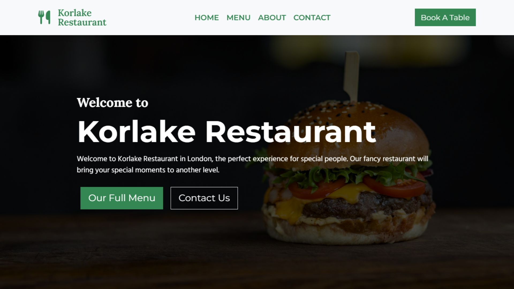

# Korlake Restaurant

## Description
A responsive, multi-page restaurant website created with [React JS](https://react.dev/) and [Bootstrap 5](https://getbootstrap.com/). It includes four main pages—Home, Menu, About, and Contact—plus a collection of six interactive components like image galleries, review displays, and a contact form. Built with scalability in mind, this project highlights modular design principles and is well-suited for restaurant startups and small businesses.

## Visit website: https://korlake-restaurant.com/

## Technologies Used
- [React JS](https://react.dev/) - JavaScript library
- [Bootstrap 5](https://getbootstrap.com/) - CSS Framework
- [Font Awesome](https://fontawesome.com/) - Icon library
- [Framer Motion](https://motion.dev/) - A modern animation library for React JS & JavaScript
- [Unsplash](https://unsplash.com/) - Free Images
- [Pexels](https://www.pexels.com/) - FREE Stock Photos & Images
- [Google Fonts](https://fonts.google.com/) - Montserrat, Lora & Hind Madurai Family Fonts

## Pages
- Home
- Menu
- About
- Contact

## Components
- `MenuBtn`
- `ImageGallery`
- `Reviews`
- `ContactForm`
- `ContactInfo`
- `Footer`

## Features
- Responsive design
- Reusable component structure
- Clean UI with smooth navigation
- Semantic HTML and accessibility best practices



## Installation
```bash
git clone https://github.com/Ionut-Cora/react-restaurant
cd react-restaurant
npm install
npm start
```
[http://localhost:3000](http://localhost:3000) - open in your browser to see the project

Created by [Ionut Cora](https://www.ionutcora.com/)